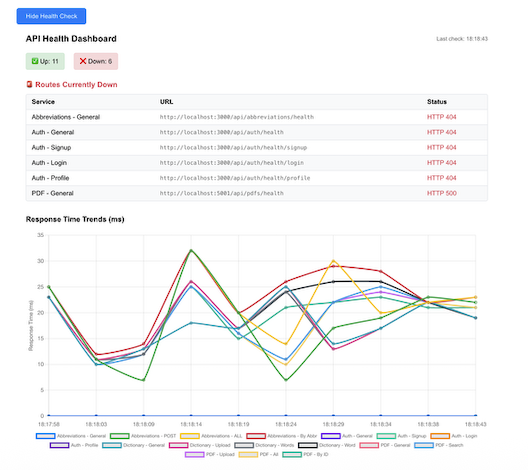

# VayuReader 📚


> A comprehensive multi-platform solution for PDF management, document search, and content discovery

[](https://reactnative.dev/)
[](https://expo.dev/)
[](https://www.nativewind.dev/)
[](https://reactnavigation.org/)
[](https://axios-http.com/)
[](https://nodejs.org/)
[](https://expressjs.com/)
[](https://www.mongodb.com/)
[](https://mongoosejs.com/)
[](https://jwt.io/)
[](https://github.com/expressjs/multer)
[](https://github.com/kelektiv/node.bcrypt.js)
[](https://www.docker.com/)
[](https://react.dev/)
[](https://tailwindcss.com/)
[](https://reactrouter.com/)

VayuReader is a powerful, multi-module platform designed for seamless PDF document management, intelligent search capabilities, and comprehensive content organization. The platform combines a mobile-first approach with robust backend services and an intuitive admin dashboard.

---

## ✨ Key Features

- 📱 **Android Mobile App** – Built with React Native (Expo) for Android platform
- 🔍 **Intelligent PDF Search** - Advanced search engine with full-text indexing
- 📖 **Dictionary Integration** - Built-in dictionary with synonyms and antonyms  
- 🔤 **Abbreviation Management** - Comprehensive abbreviation lookup system
- 🔐 **Secure Authentication** - JWT-based user authentication and authorization
- 👨‍💼 **Admin Dashboard** - Web-based content management interface
- ☁️ **Cloud-Ready** - Scalable microservices architecture

---

## 🏗️ Architecture Overview

```
┌─────────────────────┐    ┌─────────────────────┐    ┌─────────────────────┐
│   Mobile App        │    │   Backend APIs      │    │   Admin Dashboard   │
│   (React Native)    │◄──►│   (Node.js/Express) │◄──►│   (React/Tailwind)  │
│                     │    │                     │    │                     │
│ • PDF Viewer        │    │ • PDF Search        │    │ • Content Management│
│ • Search Interface  │    │ • Authentication    │    │ • User Management   │
│ • Dictionary        │    │ • Abbreviations     │    │ • File Operations   │
│ • Abbreviations     │    │ • Dictionary API    │    │ • Admin Tools       │
└─────────────────────┘    └─────────────────────┘    └─────────────────────┘
                                      │
                                      ▼
                           ┌─────────────────────┐
                           │   MongoDB Atlas     │
                           │   (Database)        │
                           └─────────────────────┘
```

## Application View 



---

## 📂 Project Structure

```
VayuReader/
├── 📱 VayuReader_Frontend/          # Mobile Application
│   ├── app/                         # File-based routing
│   ├── components/                  # Reusable UI components
│   ├── services/                    # API integration
│   └── assets/                      # Images, fonts, etc.
│
├── 🖥️ VayuReader_Backend/           # Backend Services
│   ├── pdf-search-engine/           # PDF management & search
│   ├── abrebiations/                # Abbreviation API
│   ├── dictionary-api/              # Dictionary service
│   ├── auth/                        # Authentication service
│   └── shared/                      # Common utilities
│
└── 🌐 VayuReader_AdminDashboard/    # Web Admin Interface
    ├── frontend/                    # React dashboard
    ├── components/                  # Dashboard components
    └── services/                    # Admin API calls
```

---

## 🚀 Quick Start

### Prerequisites

- Node.js 18.x or higher
- MongoDB 6.0+ (or MongoDB Atlas)
- Expo CLI
- Git
- Docker & Docker Compose (for containerized deployment)

---

### Installation (Manual)

1. **Clone the repository**
   ```bash
   git clone https://github.com/yourusername/VayuReader.git
   cd VayuReader
   ```

2. **Backend Setup**
   ```bash
   # PDF Search Engine
   cd VayuReader_Backend/pdf-search-engine
   npm install
   cp .env.example .env
   # Configure your environment variables
   npm run dev
   
   # Authentication Service
   cd ../auth
   npm install
   cp .env.example .env
   npm run dev
   
   # Repeat for other services...
   ```

3. **Frontend Setup**
   📋 What You Need Before Starting
  1. An Android phone
  2. A laptop or PC where the project is set up
  3. Make sure both phone and laptop are connected to the same Wi-Fi or hotspot

  ###  Step-by-Step Instructions (Manual)

  1. **Step 1: Install the App on Your Phone**
   ```bash
   a. Open this link on your Android phone:https://expo.dev/accounts/aryaman97/projects/IAF/builds/6f6c305f-38a8-4136-9e43-4da51b6dac02
   b. Download the file (you may need to allow your browser to download unknown apps)
   c. Tap the downloaded file and click "Install"
   ```

   2. **Step 2: Start the App from the Laptop (Only needed the first time or after changes)**
   ```bash
   
   a. Open the project folder on your laptop where the app code is (the folder is usually called VayuReader_Frontend)
   b. Right-click inside the folder and choose “Open Terminal”
   c. Run the following command in the terminal: npx expo start --dev-client

   ```

   3. **Step 3: Open the App on Your Phone**
   ```bash
   Case A: Auto Connect (Recommended)
   a. You’ll see something like this in the terminal or browser: exp://192.168.205.128:8081
   b. Now, just open the VayuReader app on your phone.
   c. If everything works, it will automatically connect and load the app.

  Case B: Manual Connect (If App Doesn't Load Automatically)
  If the app shows a blank screen or doesn't load anything:
   a. Ensure the server is still running on your laptop: npx expo start --dev-client
   b. From the terminal or browser, copy the full connection link. It will look like this: exp+iaf://expo-development-client/?url=http%3A%2F%2F192.168.205.128%3A8081
  c. Manually enter that link in the App


   ```
  4. **Step 4: What to Do If You Update the Code**
   ```bash
   a. No need to reinstall the app
   b. Just repeat Step 2 (npx expo start --dev-client) on the laptop
   c. Open the app again on your phone — it will automatically update

   ```
   5. **Step 5: When to Rebuild the App (for developers)**
   ```bash
   You only need to create a new APK if:
   a. You added native features like PDF viewer
   b. You want to give the app to someone who doesn't have access to the laptop/local server
   To rebuild: eas build --platform android --profile development

   ```


4. **Admin Dashboard Setup**
   ```bash
   cd VayuReader_AdminDashboard/frontend
   npm install
   npm start
   ```

---

### 🐳 Dockerized Backend (Recommended)

#### 1. **Configure Environment Variables**

Create `.env` files in each backend service directory (see `.env.example` for reference).

#### 2. **Build and Run All Backend Services**

From the `VayuReader_Backend` directory:

```bash
docker-compose up --build
```

This will build and start all backend services as Docker containers.

#### 3. **Access Services**

- Abbreviations API: [http://localhost:4000/api/abbreviations/all](http://localhost:4000/api/abbreviations/all)
- PDF Search Engine: [http://localhost:4001/](http://localhost:4001/)
- Dictionary API: [http://localhost:4002/](http://localhost:4002/)
- Auth API: [http://localhost:4003/](http://localhost:4003/)

#### 4. **Example `docker-compose.yml`**

```yaml
version: "3"
services:
  abrebiations:
    build: ./abrebiations
    ports:
      - "4000:3000"
    env_file:
      - ./abrebiations/.env

  pdf-search-engine:
    build: ./pdf-search-engine
    ports:
      - "4001:3000"
    env_file:
      - ./pdf-search-engine/.env

  dictionary-api:
    build: ./dictionary-api
    ports:
      - "4002:3000"
    env_file:
      - ./dictionary-api/.env

  auth:
    build: ./auth
    ports:
      - "4003:3000"
    env_file:
      - ./auth/.env
```

---

## 🔧 Configuration

### Environment Variables

Create `.env` files in each service directory:

```env
# Example .env configuration
PORT=3000
MONGODB_URI=mongodb://localhost:27017/vayureader
JWT_SECRET=your_super_secure_jwt_secret
JWT_EXPIRES_IN=7d
NODE_ENV=development
UPLOAD_PATH=./uploads
MAX_FILE_SIZE=10MB
```

---

## 📱 Mobile App Features

- **Intuitive PDF Viewer** with zoom, navigation, and bookmarking
- **Advanced Search** with filters and sorting options
- **Dictionary Integration** for instant word lookup
- **Abbreviation Expansion** for technical documents
- **User Profiles** with reading history and preferences

---

## 🔌 API Documentation

### PDF Search Engine

| Endpoint      | Method | Description                  |
|---------------|--------|------------------------------|
| `/upload`     | POST   | Upload new PDF documents     |
| `/pdfs`       | GET    | List all available PDFs      |
| `/pdfs/:id`   | GET    | Get specific PDF details     |
| `/search`     | GET    | Search PDFs by content       |


### Abbreviations API

| Endpoint                       | Method | Description                       |
|---------------------------------|--------|-----------------------------------|
| `/abbreviations`               | GET    | List all abbreviations            |
| `/abbreviations`               | POST   | Add new abbreviation              |
| `/refresh`                     | POST   | Refresh JWT token                 |

### Authentication API

| Endpoint   | Method | Description              |
|------------|--------|--------------------------|
| `/signup`  | POST   | Register new user        |
| `/login`   | POST   | User authentication      |
| `/profile` | GET    | Get current user profile |

### Dictionary API

```json
GET /dictionary/:word

Response:
{
  "word": {
    "meanings": [
      ["noun", "definition", ["synonym1", "synonym2"], ["example"]]
    ],
    "synonyms": ["word1", "word2"],
    "antonyms": ["opposite1", "opposite2"]
  }
}
```

---

## 🛠️ Technology Stack

### Frontend
- **React Native** - Cross-platform mobile development
- **Expo** - Development platform and tools
- **NativeWind** - Tailwind CSS for React Native
- **React Navigation** - Navigation library
- **Axios** - HTTP client

### Backend
- **Node.js** - Runtime environment
- **Express.js** - Web framework
- **MongoDB** - NoSQL database
- **Mongoose** - MongoDB object modeling
- **JWT** - Authentication tokens
- **Multer** - File upload handling
- **bcrypt** - Password hashing
- **Docker – Containerization for consistent and portable backend deployment

### Admin Dashboard
- **React** - UI library
- **Tailwind CSS** - Utility-first CSS framework
- **React Router** - Client-side routing

---

## 📊 Features Breakdown

### 🔍 Search Engine
- Full-text search across PDF content
- Advanced query syntax support
- Search result ranking and relevance
- Search history and suggestions

### 📚 Content Management
- Bulk PDF upload and processing
- Metadata management

### 👥 User Management
- Secure user registration and login
- Access control and permissions

---

## 🚢 Deployment

### Docker Deployment

```bash
# Build and run with Docker Compose
cd VayuReader_Backend
docker-compose up --build
```

### Manual Deployment

1. **Backend Services**: Deploy to your preferred cloud provider (AWS, GCP, Azure, Render, etc.)
2. **Frontend**: Build and deploy using Expo EAS
3. **Admin Dashboard**: Deploy to Vercel, Netlify, or similar platform

### Docker Hub

Images of the backend services has been pushed to docker hub.

---

## 🤝 Contributing

We welcome contributions! Please see our [Contributing Guide](CONTRIBUTING.md) for details.

1. Fork the repository
2. Create your feature branch (`git checkout -b feature/AmazingFeature`)
3. Commit your changes (`git commit -m 'Add some AmazingFeature'`)
4. Push to the branch (`git push origin feature/AmazingFeature`)
5. Open a Pull Request

---

## 📞 Support

- 📧 Email: support@vayureader.com

---

## 🎯 Roadmap

- [ ] AI-powered content recommendations
- [ ] Multi-language support
- [ ] Advanced analytics dashboard
- [ ] Integration with cloud storage providers
- [ ] Voice search capabilities
- [ ] Collaborative annotation features

---

<div align="center">
  <strong>Built with ❤️ for the Indian AirForce community</strong>
</div>
